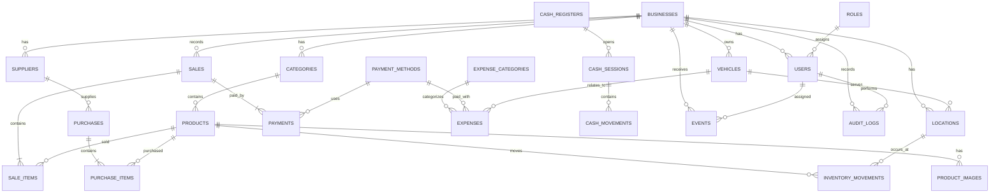

# AlDelicias — ERD V1.0



## Decisiones clave

1. `businesses` permite futuras vans/sucursales sin rediseñar la aplicación.
2. `sales`, `purchases`, `expenses` y `inventory_movements` son históricos.
3. No se borran físicamente transacciones.
4. `sale_items` conserva precio/costo/nombre como snapshot.
5. `inventory_movements` es la fuente de trazabilidad del inventario.
6. `cash_movements` permite conciliar caja.
7. `product_images` guarda referencias a Supabase Storage, no binarios en PostgreSQL.
8. RLS debe aislar los registros por `business_id`.
9. Las operaciones financieras e inventario deben ser transaccionales.
10. Los costos indirectos (bolsas, servilletas, salsas, etc.) quedan preparados para una futura capa de componentes/recetas; no deben inventarse como costo del producto hasta definir el modelo operativo.

## Flujo central

```text
PROVEEDOR
   ↓
COMPRA
   ↓
PURCHASE_ITEMS
   ↓
INVENTORY_MOVEMENTS (+)
   ↓
STOCK

PRODUCTO
   ↓
VENTA
   ↓
SALE_ITEMS
   ├── PAYMENT
   ├── INVENTORY_MOVEMENT (-)
   └── CASH_MOVEMENT

GASTO
   ├── EXPENSE
   └── CASH_MOVEMENT (si aplica)

TODO
   ↓
DASHBOARD / REPORTES
```
